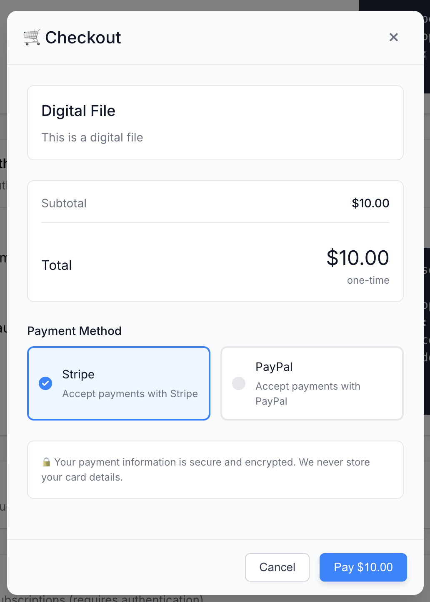
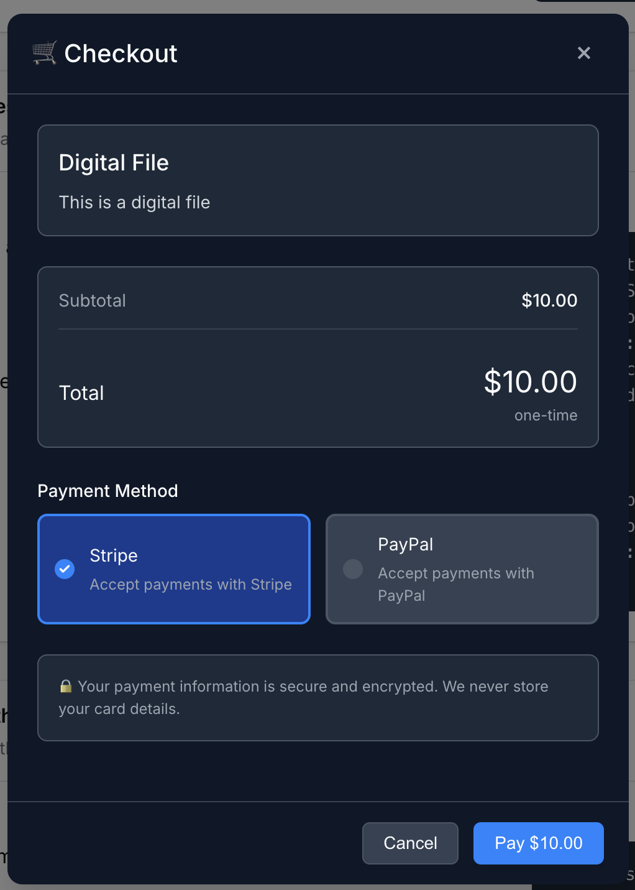
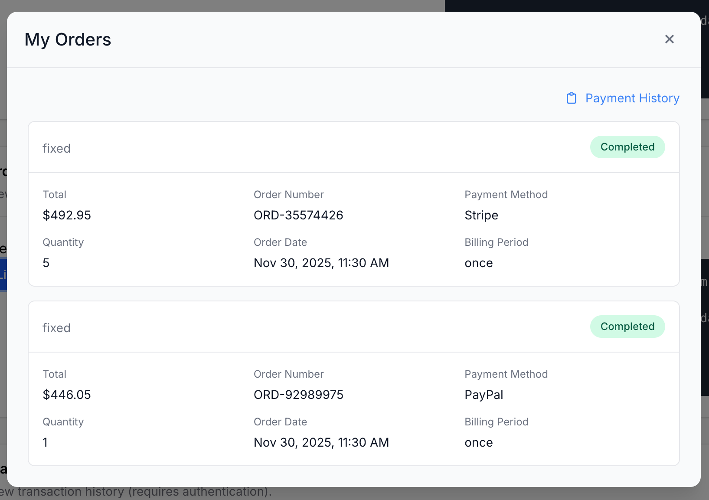
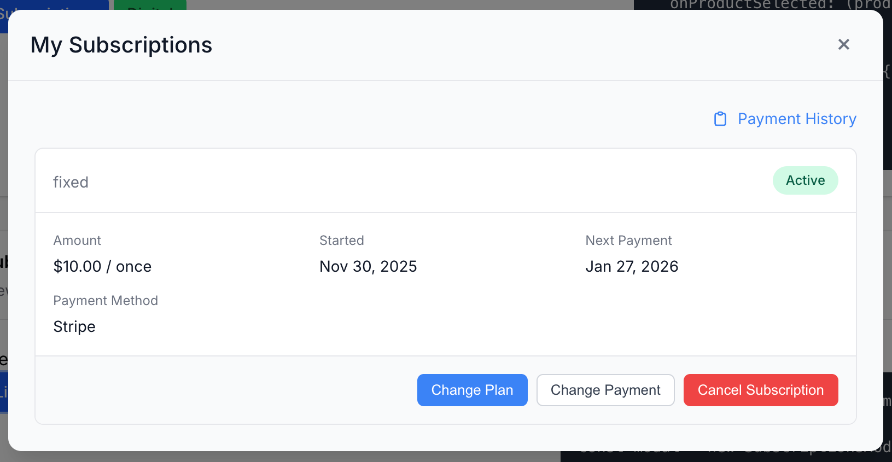
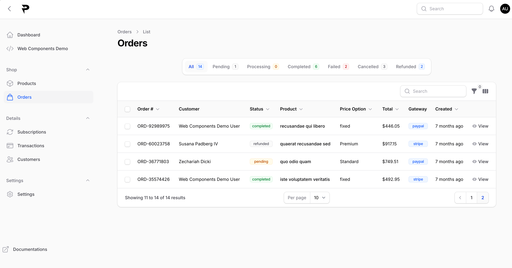

# PayCan

PayCan is an open-source, self-hosted payment and credit-management engine built for SaaS, AI apps, and modern developers. Integrate flexible payment providers, handle recurring subscriptions, and manage a complete credit-based token system in just a few lines of code.

> **[⭐️ Star PayCan on GitHub](https://github.com/paycan-app/paycan)**  
> Stars signal support and help guide future gateway integrations and roadmap features.

---

## Screenshots

<table>
<tr>
<td align="center">
<a href=".github/screenshots/checkout-light.png"></a>
<br><sub>Checkout modal (light)</sub>
</td>
<td align="center">
<a href=".github/screenshots/checkout-dark.png"></a>
<br><sub>Checkout modal (dark)</sub>
</td>
<td align="center">
<a href=".github/screenshots/orders-modal.png"></a>
<br><sub>Orders modal</sub>
</td>
<td align="center">
<a href=".github/screenshots/subscriptions-modal.png"></a>
<br><sub>Subscriptions modal</sub>
</td>
</tr>
<tr>
<td colspan="4" align="center">
<a href=".github/screenshots/admin-orders.png"></a>
<br><sub>Admin panel — Orders</sub>
</td>
</tr>
</table>

*Click any screenshot to view it at full size.*

---

## Core Feature: Credit & Token System

PayCan comes with a built-in, metered credit and wallet engine designed specifically for usage-based apps, API services, and AI agents.

- **Multi-Type Wallets**: Support distinct credit pools (e.g. `basic` compute vs. `premium` model tokens) per user.
- **Automated Top-Ups & Renewals**: Credit balances automatically replenish upon subscription renewals or one-time pack purchases.
- **Atomic Metering & Deductions**: Safely deduct credits in real time as actions occur, attaching rich metadata (`model`, `tokens_used`, `execution_id`).
- **Pre-Built Wallets Modal**: Drop-in UI component letting users inspect their live balance, view detailed consumption history, and initiate top-ups.
- **Admin Management**: Audit logs, view per-user transaction histories, and adjust balances manually via the Filament admin panel.

---

## Main Features

- **Unified Payment Gateways**: Connect Stripe and PayPal with a single unified interface — zero vendor lock-in, with more gateways coming soon.
- **Subscriptions & One-Time Products**: Sell recurring plans with automatic renewals, grace periods, plan changes, or one-time digital goods.
- **Drop-In Web Components**: 5+ framework-agnostic modal components (`WalletsModal`, `CheckoutModal`, `SubscriptionsModal`, `OrdersModal`, `TransactionsModal`) rendered in isolated Shadow DOM with full dark mode support.
- **Self-Hosted & Independent**: Retain 100% control over your database, pricing rules, and customer data with no platform fee per transaction.
- **Developer & Agent First**: Safe token-exchange architecture (server-to-server API key vs. browser-scoped JWT) and straightforward REST/SDK APIs.

---

## 💻 Sample Code


### Frontend (Client-Side: Read Balances, Checkout & Orders)

The browser SDK uses the scoped user token for read-only wallet display, self-service top-ups, and checkout flows:

```html
<script type="module">
  import { PayCan } from 'https://pay.yourapp.com/sdk/paycan-sdk.js';

  const paycan = new PayCan({ apiUrl: 'https://pay.yourapp.com' });
  paycan.setUserToken(token); // Scoped user token from your backend endpoint above

  
  //  Checkout & Orders:
  paycan.openCheckoutModal(productId, { theme: 'auto' }); // Launch checkout modal
  const orders = await paycan.orders.list();  // Retrieve user order history 
  
  
  // Wallets (Read-only UI): Display balance modal & prompt top-up
  paycan.openWalletsModal({ theme: 'auto' });


</script>
```


### Backend (Server-Side: User Sync & Secure Deductions)

Your server uses your secret `X-API-Key` to issue user tokens and securely deduct credits after processing tasks or AI runs:

```javascript
// Securely deduct credits on your server (e.g. after AI execution)
async function deductCreditsForTask(userId, tokensUsed) {
  await fetch('https://pay.yourapp.com/api/admin/wallets/deduct', {
    method: 'POST',
    headers: { 'X-API-Key': process.env.PAYCAN_API_SECRET, 'Content-Type': 'application/json' },
    body: JSON.stringify({
      user_id: userId,
      amount: tokensUsed / 1000,
      wallet_type: 'basic',
      description: `AI Task - ${tokensUsed} tokens`,
      meta: { model: 'gpt-4o' },
    }),
  });
}
```

---

## Installation & Setup

PayCan supports web-based installation wizards, Docker deployments, and standard Laravel CLI setups.

👉 **Follow the full guide in [INSTALLATION.md](INSTALLATION.md)** for:
- Web-based setup (`/install`)
- CLI installation (`php artisan paycan:install`)
- Local development instructions
- Gateway webhook configuration (Stripe & PayPal)

---

## Documentation & Resources

- **Installation**: [INSTALLATION.md](INSTALLATION.md)
- **Frontend SDK Guide**: [sdk/front/GETTING_STARTED.md](sdk/front/GETTING_STARTED.md)
- **API Reference**: [API_STRUCTURE.md](API_STRUCTURE.md)
- **Interactive Demo**: Visit `/demo` on your running instance

---

## 📄 License

PayCan is open-source software licensed under the [MIT License](LICENSE).
